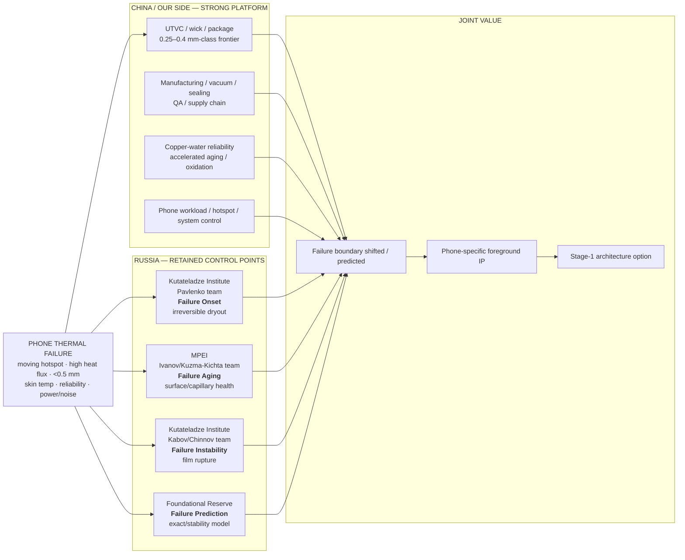

# Russia Thermal — Leadership Decision Package v0.1

Last updated: 2026-10-05

Status: **LEADERSHIP-READY DECISION SYNTHESIS / not final investment authorization**

Audience:
domestic technology leadership / thermal-roadmap decision makers.

Purpose:
compress the Russia-Thermal research database into one decision package answering:

1. What is Russia actually good at?
2. Where is China already stronger?
3. What narrow Russia-specific value still survives?
4. Who should we talk to first?
5. What is the smallest spend that can falsify each thesis?
6. What IP/control point could be worth owning?
7. What should leadership approve now — and what should it explicitly not approve?

Research authority remains in:
- `00_scope`–`09_collaboration-roadmap`;
- `evidence`;
- `PROGRESS.md`.

## Evidence-to-presentation freeze controls

- [Leadership Claim Traceability Matrix](leadership_claim_traceability_matrix_v01.md)
- [Leadership Confidence Matrix](leadership_confidence_matrix_v01.md)
- [Leadership Presentation Freeze Specification](leadership_presentation_freeze_spec_v01.md)

These three files control what may appear as a leadership headline, how confidence is displayed, and which claims must stay visibly hypothetical or unresolved.

---

# 1. Leadership headline

> **China already has the stronger smartphone thermal engineering stack. The Russian opportunity is not another cooling component; it is selective access to difficult failure-mechanism knowledge — irreversible dryout, surface aging, thin-film instability and interpretable failure-boundary modeling — that can be inserted into China's stronger phone-scale device, manufacturing and reliability platform.**

This is a **complementarity strategy**, not a country technology-transfer story.

---

# 2. One-page system view

## Interpretation

Russia does **not** need to outperform China in device engineering to be strategically useful.

Russia only needs one of its retained control points to:

> **move, predict or diagnose a phone-relevant thermal failure boundary better than a strong China-only baseline.**

---

### Four-dimensional confidence snapshot

| Institution | Team / capability | Evidence | Phone Transfer | Partner Readiness | IP Clarity |
|---|---|---|---|---|---|
| **Kutateladze Institute** | Pavlenko team | **HIGH** | **LOW-MEDIUM** | **MEDIUM-HIGH** | **MEDIUM** |
| **MPEI** | Ivanov/Kuzma-Kichta team | **HIGH** | **MEDIUM** | **HIGH** | **MEDIUM-HIGH** |
| **Kutateladze Institute** | Kabov/Chinnov team | **MEDIUM-HIGH** | **LOW** | **MEDIUM-HIGH** | **MEDIUM-HIGH** |
| **Institutional modular network** | ICM/Lavrentyev/Kutateladze/NSU | **MEDIUM-HIGH** | **LOW-MEDIUM** | **MEDIUM** | **LOW-MEDIUM** |

The purpose is to prevent strong scientific evidence from being misread as strong phone-product readiness.

# 3. The 3 + 1 leadership portfolio

| Layer | Institution | Team / PI | Failure question | Residual Russia value | Phone readiness | Current decision |
|---|---|---|---|---|---|
| **#1** | **Kutateladze Institute of Thermophysics SB RAS** | Pavlenko / Surtaev / Shvetsov / Zhukov | When does local dryout become irreversible? | dielectric reversible→irreversible crisis diagnostics | PARTIAL | **Candidate Primary Bet / Stage-0 #1** |
| **#2** | **Moscow Power Engineering Institute (MPEI)** | Ivanov / Kuzma-Kichta / Alyautdinova | Can surface/capillary aging predict later dryout-margin loss? | actual 42-month engineered-surface aging evidence | PARTIAL | **Strategic Reserve / Stage-0 #2** |
| **Reserve** | **Kutateladze Institute of Thermophysics SB RAS** | Kabov / Kochkin / Chinnov | When does a gas-sheared film become unstable and rupture? | shear-film failure-boundary physics + current electronics IP | LOW | **High-risk Mechanism/IP Reserve** |
| **Foundational** | **Modular network: ICM SB RAS + Lavrentyev Institute + Kutateladze Institute + NSU** | respective analytical/model/experiment teams | Can theory locate the boundary before experiments? | exact/stability analytical interpretability | LOW–PARTIAL | **Foundational Reserve** |

Decision cards:
- [Kutateladze Institute — Pavlenko team](leadership_card_pavlenko_v01.md)
- [MPEI — Ivanov/Kuzma-Kichta team](leadership_card_mpei_v01.md)
- [Kutateladze Institute — Kabov/Chinnov team](leadership_card_kabov_v01.md)
- [Foundational Math-Physics Reserve](leadership_card_foundational_v01.md)

---

# 4. Why the portfolio is narrow

The research explicitly killed or downgraded broad Russia claims in:

- generic ultra-thin VC;
- generic LHP miniaturization;
- generic modified mesh;
- generic dryout/rewetting;
- generic biphilic / laser surfaces;
- generic thin-film cooling;
- generic reliability engineering;
- generic fan aeroacoustics;
- generic thermal materials;
- generic DVFS;
- generic “Russia is stronger at mathematics.”

This is a feature, not a weakness.

The portfolio now contains only claims that survived:
- strong China academic comparison;
- phone/chip relevance gate;
- recent-activity check;
- primary-paper / patent pressure test.

---

# 5. Leadership card A — Kutateladze Institute / Pavlenko team

## Product question
Can Russian irreversible-crisis diagnostics shift the phone dryout boundary beyond strong modern domestic wick/control baselines?

## Why it is #1
- strongest direct failure-mechanism fit;
- current 2024–2026 activity;
- irreversible dryout is a real phone risk;
- Stage-0 can be cheap and falsifiable.

## Biggest blocker
Transfer from HFE/mesh experiments into:
- <=100 μm-class wick;
- copper;
- DI water/product fluid;
- vacuum/seal/cycle process.

## Internal Stage-0 success
At least one:
- >=15% lower evaporator Rth;
- >=20% higher dryout/capillary limit;
- >=20% faster rewetting;

plus a failure-boundary improvement.

## Leadership ask
**Approve bounded data exchange + thin-coupon Stage-0.**

Not:
sealed VC co-development yet.

---

# 6. Leadership card B — MPEI / Ivanov-Kuzma-Kichta team

## Product question
Can a surface/capillary-state metric predict future dryout-margin loss before conventional Rth/oxidation metrics?

## Why it is #2
- unusual 42-month real calendar-time dataset;
- morphology + capillary aging;
- current IP/process lineage;
- possible new reliability observable.

## Biggest blocker
Current hierarchy:
- ~100 μm-radius-class groove reference;
- low thermosyphon heat flux;
- not yet phone-scale.

## Internal Stage-0 success
Must:
- fit <=150 μm transfer ceiling or replace another structure;
- survive DI water/process;
- retain capillary/permeability;
- repeat n>=3;
- beat strong control on at least one thermal metric;
- show useful aging→dryout-margin relationship.

## Leadership ask
**Approve bounded geometry-scale + aging-correlation Stage-0.**

Not:
claim Russia reliability leadership.

---

# 7. Leadership card C — Kutateladze Institute / Kabov-Chinnov team

## Product question
Can a shear-film / gas-drop architecture ever beat simpler passive/active phone cooling after full-loop costs are counted?

## Why keep it
- deep mechanism lineage;
- strong instability/dry-spot physics;
- current 2026 electronics-cooling IP;
- could matter in a future extreme-hotspot regime.

## Why not fund it as a Bet yet
Current architecture implies:
- gas supply;
- liquid supply;
- nozzles;
- local 3–7 mm expansion;
- parasitic power;
- acoustic and package burden.

## Leadership ask
**Approve only reduced feasibility / modeling / partner-data work.**

Do not:
fund full phone prototype.

---

# 8. Leadership card D — Foundational Reserve summary

## Product question
Can analytical/stability models reduce the number of experiments required to locate failure?

## Why keep it
Russia retains a continuous exact/group-invariant evaporative-thermocapillary modeling tradition linked to experiment.

## Strong China challenge
China already has:
- nonlinear stability;
- phase-change numerics;
- inverse thermal diagnostics;
- strong CFD/data-driven engineering.

## Internal blind-benchmark target
- >=80% stable/unstable classification;
- <=15–20% boundary error;
- >=50% experiment-grid reduction;
- clearer mechanism attribution.

## Leadership ask
**Approve one blind benchmark.**

Do not:
fund a broad “Russian mathematics” program.

---

# 9. Tomsk Polytechnic University — Feoktistov/Orlova Challenger sidebar

Tomsk Polytechnic University (TPU) — Feoktistov/Orlova team remains important but is **not one of the 3 + 1 Russia strategic differentiation cores**.

Why it remains Stage-0 #3:
- current laser/wettability process;
- partner-linked patent;
- easy coupon falsification;
- may provide a useful process route.

Why it is not promoted to the core:
- China/global biphilic and laser-wick prior art is crowded;
- copper transfer is unresolved;
- hydrocarbon-functionalized branch raises outgassing/contamination risk;
- no Russia-specific broad laser/biphilic advantage survives.

Stage-0 design:
- copper laser-only low-organic arm;
- copper biphilic/hydrocarbon arm;
- strong generic domestic control;
- vacuum / mass-loss / DI-water / wetting-retention screen first.

Decision:
**Challenger — GO WITH PREREQUISITE, but not a Russia country-level differentiator.**

Detailed packet:
[TPU Stage-0 brief](../09_collaboration-roadmap/partner_brief_tpu_stage0_v01.md)

---

# 10. Supporting nodes — useful but not Bets

| Node | Value | Correct role |
|---|---|---|
| **JIHT RAS** | MPEI-adjacent current microchannel/boiling capability | supporting experimental node |
| **SPbPU** | gradient heatmetry; local/transient heat-flux; power-electronics immersion work | diagnostics/test-support option |
| **NSU** | two-phase labs, diagnostics, talent | execution/talent bridge |
| **Lavrentyev** | microfilm/microchannel modeling | detailed model module |
| **ICM/Altai** | exact/stability analytical model | optional foundational module |
| **Maydanik / ITP UB RAS** | deep LHP knowledge | Watch / expert reserve |
| **TsAGI / PNRPU / CIAM** | aeroacoustic methods | Watch / method reserve |
| **SPbU** | smartphone thermal-control lineage | complementary/test |

Do not mistake institutional prestige for a product Bet.

---

# 11. Normalized leadership comparison

| Dimension | Kutateladze / Pavlenko team | MPEI / Ivanov team | Kutateladze / Kabov team | Foundational network |
|---|---:|---:|---:|---:|
| Direct phone failure relevance | **High** | Medium | Medium | Medium |
| Russia-specific residual after China comparison | **Medium-High** | Medium | Medium | Medium |
| Current 2023–2026 activity | **High** | **High** | **High** | **High** |
| Product geometry readiness | Low-Medium | Low | **Low** | N/A / Low |
| Working-fluid/process readiness | Low | Low-Medium | Low | N/A |
| Strong falsification experiment | **High** | **High** | Medium | **High** |
| Background-IP clarity | Medium | Medium-High | Medium-High | Medium |
| Potential foreground control point | **High** | Medium-High | Medium | Medium |
| Stage-0 spend efficiency | **High** | **High** | Medium-Low | **High** |
| Current leadership action | **Fund bounded Stage-0** | **Fund bounded Stage-0** | Feasibility only | Blind benchmark |

This table is a decision normalization, not a universal scientific ranking.

---

# 12. What leadership should approve now

## Approve

### A. Three bounded Stage-0 surface/coupon interactions

1. **Kutateladze Institute — Pavlenko team**
   - highest priority;
   - thin-wick irreversible-dryout transfer.

2. **MPEI — Ivanov/Kuzma-Kichta team**
   - geometry scale-down + aging-health indicator.

3. **TPU — Feoktistov/Orlova team**
   - low-outgassing process challenger.

### B. One reduced high-risk feasibility track

**Kutateladze Institute — Kabov/Chinnov team**
- model + reduced cell;
- full-loop power/volume/noise accounted.

### C. One blind foundational benchmark

**Kutateladze/Lavrentyev/NSU + optional ICM/Altai**
- failure-boundary prediction;
- compare directly against domestic numerical baseline.

---

# 13. What leadership should NOT approve now

Do not approve:

- large “Russia thermal technology” umbrella program;
- acquisition/transfer of a generic Russian VC/LHP solution;
- sealed-device co-development before Stage-0 survives;
- broad materials program;
- generic laser/biphilic collaboration;
- generic fan/aeroacoustic program;
- generic DVFS program;
- broad theoretical-mathematics collaboration without blind benchmark;
- any strategic claim based on institutional prestige alone.

---

# 14. Resource logic

The portfolio intentionally uses **option-value spending**.

## Stage 0

Spend only enough to answer:
> Is there a phone-relevant control point?

Deliverables:
- partner-shareable process/data envelope;
- thin coupon;
- strong domestic reference;
- normalized measurement;
- success/kill result;
- background/foreground IP discussion.

## Stage 1

Only surviving mechanisms enter:
- sealed device;
- identical shell/footprint/fluid/fill/seal;
- strong product reference;
- dynamic phone-equivalent hotspot;
- reliability/process cycle.

## Stage 2+

Only after:
- repeatable device gain;
- manufacturability;
- reliability;
- foreground-IP path;
- system-level value.

---

# 15. 0–36 month decision logic

## 0–6 months
- partner data exchange;
- coupons;
- failure-boundary measurements;
- blind model benchmark;
- kill weak transfer paths.

## 6–18 months
For survivors only:
- sealed Stage-1 device;
- phone-equivalent dynamic hotspot;
- reliability/process screen;
- foreground-IP filing hypothesis.

## 18–36 months
For validated survivors only:
- product integration;
- supplier/process transfer;
- system control;
- reliability qualification;
- joint IP/licensing structure.

The roadmap should narrow over time, not accumulate projects.

---

# 16. Foreground-IP logic

The project should not seek generic claims.

More credible joint foreground spaces:

### Kutateladze Institute — Pavlenko team
- irreversible-dryout transition criterion;
- product-fluid thin-wick process state;
- moving-hotspot rewetting topology.

### MPEI — Ivanov/Kuzma-Kichta team
- dryout-health indicator;
- age-resistant capillary state;
- phone-scale geometry/process/aging correlation.

### Kutateladze Institute — Kabov/Chinnov team
- phone-constrained instability-control geometry;
- low-power staged film/gas control;
- hybrid local cell + passive spreader.

### Foundational
- phone-specific model → observable → control/geometry chain.

---

# 17. Leadership narrative — recommended wording

> **Our research does not support the view that Russia has a stronger smartphone cooling industry than China. China is ahead in ultra-thin two-phase hardware, manufacturing, integration and product reliability. What survives after a strong China comparison is narrower and potentially more valuable: selected Russian groups have deep knowledge of difficult thermal failure boundaries — when dryout becomes irreversible, how engineered surfaces age over real time, when thin films become unstable, and how some of those boundaries can be predicted analytically. We recommend using small Stage-0 experiments to test whether those mechanisms create phone-specific control points. If they do, China-scale engineering turns them into product/IP options; if they do not, we stop early.**

---

# 18. Decision at this research state

## Recommended portfolio state

**Kutateladze Institute — Pavlenko team**
→ **KEEP / Candidate Primary Bet / spend Stage-0**

**MPEI — Ivanov/Kuzma-Kichta team**
→ **KEEP / Strategic Reserve / spend Stage-0**

**TPU — Feoktistov/Orlova team**
→ **KEEP as Challenger / spend Stage-0**

**Kutateladze Institute — Kabov/Chinnov team**
→ **KEEP as High-risk Mechanism/IP Reserve / feasibility only**

**Foundational network**
→ **KEEP as Foundational Reserve / blind benchmark**

**Maydanik / aeroacoustics / SPbU**
→ **WATCH**

Broad generic Russia superiority theses
→ **KILL / do not fund**

---

# 19. Gate before final investment recommendation

This package is ready for leadership strategic framing.

It is **not** final investment authorization because the following remain unresolved:

1. partner willingness / current ownership;
2. partner-shareable process windows;
3. Stage-0 physical coupon results;
4. exact IP/background/foreground negotiation;
5. sealed phone-device transfer;
6. manufacturability / reliability;
7. Kabov full-loop power/noise/volume;
8. foundational blind-benchmark result.

The final recommendation must be driven by those results, not by additional broad literature collection.

---

# 20. Authority links

System view:
- [Russia Thermal Capability System Map](management_capability_map_v01.md)
- [Capability Map Completeness Audit](../03_russia-institutions/capability_map_completeness_audit_v01.md)

Decision cards:
- [Pavlenko](leadership_card_pavlenko_v01.md)
- [MPEI](leadership_card_mpei_v01.md)
- [Kabov](leadership_card_kabov_v01.md)
- [Foundational Reserve](leadership_card_foundational_v01.md)

Execution:
- [Stage-0 Partner × Technology Scorecard](../09_collaboration-roadmap/stage0_partner_technology_decision_scorecard_v01.md)
- [PoC-1 Stage-0 Coupon Matrix](../09_collaboration-roadmap/poc01_stage0_coupon_matrix_v01.md)
- [Collaboration Portfolio](collaboration_portfolio_v01.md)

Evidence:
- [Readable Bibliography](../evidence/readable_bibliography.md)
- [Paper 10Q Cards](../evidence/paper_10q_cards_core_v01.md)
- [Patent 10Q Cards](../evidence/patent_10q_cards_core_v01.md)
