# Russia Thermal Failure-Mechanism & Foundational Capability Map v0.1

Last updated: 2026-10-05

Status: **CURRENT management-facing synthesis draft**

Purpose:
provide a leadership-ready system view of:
- where Russian thermal capability sits;
- what China already does better;
- what Russia may still contribute;
- which collaboration hypotheses survive;
- what must be proven before investment.

This file is a **presentation / synthesis layer**.
Research authority remains in 00–09 and `PROGRESS.md`.

---

# 1. Executive management conclusion

## One-sentence answer

> **Russia is not currently a stronger smartphone thermal-device ecosystem than China; its most credible complementary value is concentrated in deep failure-mechanism diagnosis, long-time surface-state evolution, thin-film instability physics, and interpretable mathematical-physics models that can be inserted into China's stronger phone-scale manufacturing / UTVC / product-reliability platform.**

## What Russia is **not** currently evidenced to lead

Do not sell the collaboration story as:
- better ultra-thin VC manufacturing;
- better generic wick design;
- better generic LHP miniaturization;
- better generic laser/biphilic surfaces;
- better generic fan aeroacoustics;
- better generic thermal materials;
- better generic DVFS;
- better product reliability engineering.

China/global public evidence is already stronger or at least equally strong in those broad categories.

## Where Russia still has a plausible differentiated control point

1. **Kutateladze / Pavlenko**
   - dielectric reversible → irreversible dry-spot / boiling-crisis diagnostics;
   - current Stage-0 priority #1.

2. **MPEI / Ivanov**
   - actual 42-month engineered-surface aging evidence;
   - current Stage-0 priority #2 / Strategic Reserve.

3. **Kutateladze / Kabov–Kochkin–Chinnov**
   - shear-driven microfilm / dry-spot / rupture / interfacial-instability physics under extreme confinement;
   - high-risk mechanism reserve.

4. **ICM / Altai + Lavrentyev + Kutateladze/NSU**
   - exact / stability / interpretable mathematical-physics layer;
   - Foundational Reserve, not a product bet by itself.

Cross-cutting:
**Siberian modular capability network** =
Kutateladze anchor + Lavrentyev fluid model + NSU execution/diagnostics + optional ICM/Altai analytical-stability module.

---

# 2. Leadership system diagram

```mermaid
flowchart TB

    P["SMARTPHONE THERMAL PROBLEM<br/>moving hotspot · high heat flux · <0.5 mm two-phase structure<br/>skin temperature · battery/camera/board · reliability · acoustics · power"]

    subgraph R0["RUSSIA — FOUNDATIONAL SCIENCE"]
        ICM["ICM SB RAS / Altai line<br/>exact solutions · stability · bifurcation<br/>interpretable failure boundary"]
        LIH["Lavrentyev Institute<br/>evaporating-film / microchannel fluid model"]
        NSU["Novosibirsk State University<br/>thin-film / boiling labs · diagnostics · talent"]
    end

    subgraph R1["RUSSIA — SURVIVING FAILURE-MECHANISM CORE"]
        PAV["Kutateladze — Pavlenko / Surtaev / Shvetsov / Zhukov<br/><b>Irreversible dryout / boiling crisis</b><br/>Stage-0 #1"]
        MPEI["MPEI — Ivanov / Kuzma-Kichta / Alyautdinova<br/><b>Actual multi-year engineered-surface aging</b><br/>Stage-0 #2"]
        KAB["Kutateladze — Kabov / Kochkin / Chinnov<br/><b>Shear-film instability / dry spot / rupture</b><br/>High-risk reserve"]
    end

    subgraph R2["RUSSIA — ENGINEERING CHALLENGER / WATCH"]
        TPU["TPU — Feoktistov / Orlova<br/>laser / wettability-pattern process<br/>Stage-0 #3 challenger"]
        LHP["ITP UB RAS — Maydanik line<br/>LHP knowledge / failure analysis<br/>WATCH"]
        FAN["TsAGI / PNRPU / CIAM<br/>aeroacoustic methods<br/>WATCH"]
        CTRL["SPbU<br/>smartphone stochastic DVFS / EHD adjacency<br/>COMPLEMENTARY / TEST"]
    end

    subgraph CN["CHINA — STRONG BASELINE"]
        CVC["UTVC / wick / manufacturing<br/>0.25–0.4 mm-class frontier<br/>strong copper-water device baseline"]
        CDRY["Dryout / rewetting / wick failure<br/>GDUT · SCUT · SJTU · Changsha UST"]
        CREL["VC reliability / accelerated life / QA<br/>SCUT-led + industry · XJTU mobile mLHP"]
        CFILM["Thin-film / high-flux / droplet<br/>NCEPU · CAS · Beihang"]
        CMATH["Stability / phase-change numerics / inversion<br/>HIT · CAS · XJTU · HUST · IMU"]
        CFAN["Electronic fan aeroacoustics<br/>Beihang · PKU/HKUST · SJTU"]
    end

    ICM -. "historical theory–experiment lineage<br/>current method continuity" .-> PAV
    ICM -. "optional analytical module" .-> KAB
    LIH -->|"verified current model/mechanism link"| KAB
    NSU -->|"current talent / lab / diagnostics bridge"| PAV
    NSU -->|"execution / diagnostics"| KAB

    PAV -->|"translate failure diagnostic/control"| P
    MPEI -->|"translate aging indicator"| P
    KAB -->|"translate instability boundary"| P
    ICM -->|"blind analytical failure-boundary test"| P

    CVC --> P
    CDRY --> P
    CREL --> P
    CFILM --> P
    CMATH --> P
    CFAN --> P

    TPU -. "process challenger only" .-> P
    LHP -. "knowledge reserve" .-> P
    FAN -. "method reserve" .-> P
    CTRL -. "software/control complement" .-> P
```

### How to read this figure

The center message is not:
> Russia has more thermal technologies.

It is:
> **China has the stronger phone-device platform; selected Russian groups may add failure-boundary knowledge that China can industrialize faster.**

---

# 3. Full Russia capability panorama

| Capability domain | Main Russian institutions / people | Publicly evidenced strength | China / global position | Management state |
|---|---|---|---|---|
| Dielectric boiling / crisis | **Kutateladze — Pavlenko, Surtaev, Shvetsov, Zhukov** | HFE-7100 / Novec dry-spot statistics, IR/optical/ML diagnostics, crisis transition | China already strong in dryout/rewetting and structured-wick boiling | **ACTIVE #1 — narrow differentiation** |
| Hierarchical evaporator aging | **MPEI — Ivanov, Kuzma-Kichta, Alyautdinova** | 42-month actual engineered-surface operation + capillary aging | China stronger in product VC reliability / accelerated life | **ACTIVE #2 — narrow differentiation** |
| Shear-driven microfilm | **Kutateladze — Kabov, Kochkin, Chinnov** | film deformation, dry spot, shear/Marangoni instability, extreme slit experiments | China stronger in headline thin-film heat flux | **HIGH-RISK RESERVE** |
| Laser / biphilic surface | **TPU — Feoktistov, Orlova** | laser roughness / wettability processing; claim-mapped patent | China/global prior art crowded | **STAGE-0 #3 CHALLENGER** |
| Ordered porous wick | **MPEI ordered-wick line** | modeling / porous concept | no physical phone-scale specimen | **HOLD / PRE-DEVICE** |
| LHP / passive routing | **ITP UB RAS — Maydanik lineage** | deep LHP knowledge / serviceability / failure history | China covers mobile LHP, multi-evaporator and failure boundaries | **WATCH / KNOWLEDGE RESERVE** |
| Microchannel / embedded liquid | Kutateladze; **MPEI + JIHT RAS**; Bauman | two-phase micro/slit-channel physics; current MPEI–JIHT boiling collaboration | China integration frontier stronger | **MECHANISM / SUPPORTING SOURCE ONLY** |
| Aeroacoustics | **TsAGI / PNRPU / CIAM** | world-class aeroacoustic methods/facilities | China already strong in electronic cooling fan acoustics | **WATCH / METHOD RESERVE** |
| Active air / synthetic jet / EHD | Kutateladze / SPbU adjacency | fragmented public signal | China/global evidence stronger | **UNRESOLVED / LOW PRIORITY** |
| Thermal materials | Skoltech / MISIS / MSU / SPbU | materials science depth | no phone-specific Russia edge | **KILL GENERIC THESIS** |
| Mobile thermal control | **SPbU** | smartphone stochastic DVFS lineage | generic DVFS/RL crowded | **COMPLEMENTARY / TEST** |
| Foundational math physics | **ICM SB RAS / Altai / Lavrentyev** | exact/group-invariant solutions, stability thresholds, model–experiment lineage | China broader in numerics/inverse/modeling | **FOUNDATIONAL RESERVE** |
| Diagnostics / reliability methods | Kutateladze / MPEI / TPU / **SPbPU gradient heatmetry** / TsAGI | long experimental lineages; optical diagnostics; direct local/transient heat-flux sensing; mechanism diagnosis | China also strong; partner-specific value only | **CROSS-CUTTING ENABLER** |

---

# 4. Strategic core — the 3 + 1 structure

## Core 1 — Pavlenko / Kutateladze

### Failure question
When does a recoverable dry region become an **irreversible dryout / thermal runaway**?

### Russia evidence
- HFE-7100 / Novec 649;
- high-speed IR;
- reflected-light / phase visualization;
- ML-assisted dry-spot segmentation;
- contact-line / dry-area statistics;
- irreversible dry-spot propagation;
- crisis-mode transition with liquid inventory / layer height;
- modified-surface drying-front evidence.

### Strong independent China comparator
- GDUT — capillary-fed dryout, steam-induced rewetting, cycle degradation;
- SCUT — treated copper mesh / capillary-film boiling;
- SJTU — pore-scale dryout model;
- Changsha UST — HFE-7100 confinement to 1 mm;
- strong China UTVC device baseline.

### What survives
Not:
**dryout/rewetting expertise in general.**

Survives:
**dielectric reversible → irreversible dry-spot / boiling-crisis diagnostic depth.**

### Phone transfer hypothesis
Use the Russian diagnostic/process knowledge to:
- identify first reversible dry spot;
- predict irreversible transition;
- delay irreversible-dryout onset;
- improve recovery;
in a 60–100 μm-class wick / ~0.2 mm internal-scale phone reference.

### Stage-0
**Priority #1 — GO WITH PREREQUISITE.**

### Promotion gate
Russian-guided route must beat strong domestic controls on:
- irreversible-dryout onset;
- dry-spot propagation;
- rewetting;
- post-cycle capillary/wetting state;
while surviving copper / DI water / vacuum / process constraints.

### Candidate foreground IP
- phone-scale dryout-transition diagnostic criterion;
- surface/process state that shifts irreversible-dryout boundary;
- control/geometry combinations tied to product-fluid and sealed VC process.

---

## Core 2 — MPEI / Ivanov

### Failure question
Can an engineered evaporator surface **age functionally before nominal thermal resistance visibly fails**?

### Russia evidence
- actual **42-month** calendar-time operation;
- microgroove + Al2O3 hierarchy;
- R410A thermosyphon;
- periodic thermal measurements;
- post-operation morphology;
- residual capillary behavior;
- capillary aging despite comparatively stable integral Rth.

### Strong China comparator
China is stronger in:
- copper-water VC oxygen-driven failure physics;
- vacuum/process oxygen control;
- 150–200 °C accelerated lifetime prediction;
- XPS/EDS;
- oxidation production QA;
- 0.7 mm mobile mLHP + 30-day 90 °C aging.

### What survives
Not:
**Russia reliability leadership.**

Survives:
**actual multi-year same-surface aging evidence.**

### Phone transfer hypothesis
A surface-state / capillary metric may become an:
**early-warning indicator of future dryout-margin loss**
before Rth failure becomes visible.

### Stage-0
**Priority #2 — GO WITH PREREQUISITE / Strategic Reserve.**

### Promotion gate
Must show:
- scale-down;
- copper / DI water / vacuum compatibility;
- repeatable surface/capillary aging;
- correlation with later dryout-margin degradation;
- predictive value beyond domestic oxidation metrics.

### Candidate foreground IP
- phone evaporator aging-health metric;
- dryout-margin health index;
- accelerated-test calibration using capillary/morphology state.

---

## Core 3 — Kabov / Chinnov / Kutateladze

### Failure question
Under extreme confinement and gas shear, when does a stable liquid film become:
**deformed → unstable → dry spot → rupture / crisis**?

### Russia evidence
- long shear-driven liquid-film lineage;
- local heating / dry-spot / CHF studies;
- thermocapillary and gas-shear coupling;
- extreme thin slit evidence including ~12.5 μm channel/slit-scale work;
- current model bridge with Lavrentyev;
- experimental/talent bridge through NSU;
- **RU2860581C1 (2026)** — current Kutateladze/Kabov electronics-cooling IP with staged gas / droplet / gas-sheared liquid-film modes under variable heat load.

### Strong China comparator
- NCEPU high-heat-flux thin-film boiling;
- CAS/NCEPU gradient-mesh film;
- broad Chinese microfilm / droplet / high-flux capability.

### What survives
Not:
**Russia thin-film cooling leadership.**

Survives:
**shear-driven free-surface instability / dry-spot / rupture physics under extreme confinement.**

### Phone transfer hypothesis
Use a gas-driven / hybrid thin-film route only if:
- instability boundary can be predicted;
- parasitic power is acceptable;
- film inventory can be controlled;
- system volume beats passive alternatives.

### State
**HIGH-RISK MECHANISM/IP RESERVE.**

Current IP/activity confidence is stronger after direct review of RU2860581C1, but phone-transfer readiness remains LOW because active gas/liquid supply, millimeter-scale local expansion and system overhead remain unresolved.

### Promotion gate
Blind prediction of instability / rupture boundary plus a system-level power-volume comparison versus passive UTVC.

### Candidate foreground IP
- phone-scale instability-control geometry;
- shear/film-inventory control law;
- hybrid film/air routing architecture.

---

## Foundational Reserve — ICM / Altai / Lavrentyev + Kutateladze / NSU

### Foundational question
Can Russian exact/stability mathematics reduce the number of experiments needed to locate a **failure boundary**?

### Russia evidence
- continuous exact / group-invariant evaporative-convection work;
- stability thresholds;
- analytical interpretability;
- historical direct theory–experiment linkage;
- current Kutateladze ↔ Lavrentyev model/mechanism link;
- current Kutateladze ↔ NSU execution/diagnostics bridge.

### Strong China comparator
China is strong in:
- nonlinear stability;
- phase-change numerics;
- inverse thermal problems;
- PINN / diagnostic methods;
- validated engineering simulation.

### What survives
Not:
**Russia is mathematically stronger in general.**

Survives:
**exact / interpretable analytical failure-boundary tradition.**

### Collaboration architecture
**Kutateladze anchor**
+ Lavrentyev fluid model
+ NSU diagnostics/talent
+ optional ICM/Altai analytical-stability module.

Do not call this an integrated consortium.

### PoC
Blind benchmark:
- predict instability/dryout boundary before experiment;
- compare accuracy and number of required experiments against strong numerical/data-driven baseline.

### Promotion gate
Only promote if the analytical route:
- predicts the failure boundary materially better or earlier; or
- reduces experiment count / design iteration cost.

---

# 5. Russia × China leadership comparison

| Decision dimension | China | Russia | What collaboration should exploit |
|---|---|---|---|
| Phone-scale UTVC / miniaturization | **Strong advantage** | weak public frontier | China hardware/manufacturing platform |
| Wick / capillary design | **Strong advantage** | useful mechanism/process lines | only Russian mechanism that survives strong Chinese control |
| Product reliability engineering | **Strong advantage** | MPEI unusual calendar-time dataset | combine China process QA + Russia long-time surface-state insight |
| Dryout / rewetting | strong | strong | Russia only on irreversible-crisis diagnostic specificity |
| Thin-film headline heat flux | **strong** | strong mechanism lineage | Russia on shear-instability boundary, not headline heat flux |
| Numerical/inverse modeling | **strong / broad** | strong | Russia only where exact/interpretable model reduces experiments |
| Failure-regime diagnostics | strong but distributed | **notable partner-specific depth** | joint failure-map / boundary discovery |
| Materials / graphite / TIM | **strong advantage** | broad science, no phone edge | no Russia collaboration thesis now |
| LHP miniaturization | **strong advantage** | foundational history | use Russian expert review only |
| Fan acoustics | strong electronics-specific stack | strong general aeroacoustic methods | only benchmark at actual phone microfan scale |
| Manufacturing / supply chain | **dominant** | not evidenced at phone scale | China executes productization |
| Long experimental lineage | strong | **notable in selected RAS/MPEI groups** | use for difficult failure questions |

---

# 6. Why Russia can still be worth collaborating with

The collaboration thesis should be:

> **Do not outsource phone thermal engineering to Russia. Use selected Russian groups to attack hard failure-boundary questions that are expensive to rediscover, then integrate the answer into China's stronger mobile engineering/manufacturing platform.**

This is a much stronger management argument than:
> Russia has good thermophysics.

The potential value chain is:

**Russian mechanism / diagnostics / mathematical physics**
→
**our phone boundary condition + workload + package knowledge**
→
**China-scale coupon / UTVC / process capability**
→
**falsification**
→
**foreground IP**
→
**product architecture option**

---

# 7. Collaboration portfolio — leadership view

| Rank / layer | Partner / network | Management question | Current state | Next spend |
|---|---|---|---|---|
| **#1** | Kutateladze / Pavlenko | Can irreversible dryout be shifted beyond strong China wick controls? | Candidate Primary Bet / narrow | Stage-0 data exchange + thin coupon |
| **#2** | MPEI / Ivanov | Can capillary/surface aging predict future loss of dryout margin earlier than Rth? | Strategic Reserve / narrow | aging dataset + scaled coupon |
| **#3** | TPU / Feoktistov | Can a low-outgassing patterned surface survive sealed-VC manufacturing and outperform generic laser control? | Challenger | copper laser-only vs biphilic Stage-0 |
| **Reserve** | Kabov / Chinnov | Does shear-driven film control create a system-level advantage after parasitic power/volume? | High-risk mechanism reserve | reduced feasibility + stability-boundary test |
| **Foundational** | Kutateladze + Lavrentyev + NSU + optional ICM/Altai | Can analytical/stability modeling reduce experiments and predict failure? | Foundational Reserve | blind boundary benchmark |
| **Watch** | TsAGI / PNRPU / CIAM | Better source diagnosis on real phone microfan? | Method reserve | only if equal-envelope fan becomes strategic |
| **Watch** | ITP UB RAS / Maydanik | Useful expert/failure review beyond China LHP baseline? | Knowledge reserve | no dedicated device bet now |

---

# 8. Kill map — credibility layer

Broad theses removed or reframed during research:

- generic Russia ultra-thin VC advantage → **KILLED**
- generic Russia LHP miniaturization advantage → **KILLED**
- generic Russia modified-mesh advantage → **KILLED**
- generic Russia dryout/rewetting advantage → **KILLED**
- generic Russia biphilic/laser-surface advantage → **KILLED / REFRAMED**
- generic Russia thin-film cooling advantage → **KILLED / REFRAMED**
- generic Russia long-term reliability advantage → **KILLED / REFRAMED**
- generic Russia fan-aeroacoustic advantage → **DOWNGRADED TO WATCH**
- generic Russia thermal-material advantage → **KILLED**
- generic Russia DVFS advantage → **KILLED / COMPLEMENTARY**
- generic "Russia math is better" → **KILLED**
- exact/interpretable failure-boundary math → **FOUNDATIONAL RESERVE**

What remains is narrower but more defensible.

---

# 9. Leadership-ready strategic statement

Recommended wording:

> **China already leads the mobile thermal engineering stack in ultra-thin two-phase hardware, manufacturing, product reliability and integration. The Russian opportunity is therefore not to buy another cooling device, but to selectively acquire or co-develop hard-to-reproduce failure-mechanism knowledge. The strongest current Russian signals are irreversible boiling-crisis diagnostics, actual multi-year engineered-surface aging, shear-driven thin-film instability physics, and an interpretable mathematical-physics lineage linked to experiment. Our strategy is to combine these with China-scale phone hardware and manufacturing, use Stage-0 falsification to kill weak transfers early, and retain only control points that shift a measurable phone failure boundary.**

---

# 10. What leadership should approve now

Not:
- a large Russian university collaboration program;
- a broad "Russia thermal technology" investment;
- immediate sealed-device co-development.

Recommended:
1. **three bounded Stage-0 technical exchanges / coupon tests**
   - Pavlenko;
   - MPEI/Ivanov;
   - TPU/Feoktistov.

2. **one high-risk mechanism reserve**
   - Kabov/Chinnov shear-film route.

3. **one foundational blind benchmark**
   - Kutateladze/Lavrentyev/NSU + optional ICM/Altai.

4. Keep:
   - Maydanik;
   - aeroacoustics;
   - SPbU control
as watch / expert options rather than funded bets.

---

# 11. Evidence maturity

| Direction | Evidence maturity | Phone transfer | Current management label |
|---|---|---|---|
| Pavlenko irreversible-dryout boundary | SYSTEM_VALUE mechanism | PARTIAL | **Candidate Primary Bet / Stage-0 #1** |
| MPEI multi-year surface aging | SYSTEM_VALUE aging evidence | PARTIAL+ | **Strategic Reserve / Stage-0 #2** |
| TPU patterned surface | STRUCTURAL_SIGNAL → early SYSTEM_VALUE | PARTIAL | **Challenger / Stage-0 #3** |
| Kabov shear-film instability | SYSTEM_VALUE mechanism | LOW | **High-risk Reserve** |
| Foundational exact/stability math | STRUCTURAL_SIGNAL | LOW | **Foundational Reserve** |
| Maydanik LHP | strong domain lineage | China baseline closes differentiation | **Watch** |
| TsAGI/PNRPU aeroacoustics | strong method lineage | phone scale unproven | **Watch** |
| Generic VC/materials/DVFS | broad capability exists | no Russia-specific control point | **Killed / reframed** |

---

# 12. Evidence / authority pointers

Russia capability:
- [Russia Thermal Capability Atlas](../03_russia-institutions/russia_thermal_capability_atlas_v01.md)
- [Russia Foundational Math-Physics Capability](../03_russia-institutions/russia_foundational_math_physics_capability_v01.md)
- [Siberian Theory–Fluid–Experiment Network](../03_russia-institutions/siberian_theory_fluid_experiment_network_v01.md)

China baseline:
- [China Academic Capability Mirror](../07_china-benchmark/china_academic_capability_mirror_v01.md)
- [China Foundational Math-Physics Mirror](../07_china-benchmark/china_foundational_math_physics_mirror_v01.md)

Pressure tests:
- [Russia × China Academic Capability Heatmap](../08_opportunities-transfer/russia_china_academic_capability_heatmap_v01.md)
- [Pavlenko Dryout/Rewetting China Pressure Test](../08_opportunities-transfer/pavlenko_dryout_rewetting_china_pressure_test_v01.md)
- [MPEI Multi-Year Aging China Pressure Test](../08_opportunities-transfer/mpei_multiyear_aging_china_pressure_test_v01.md)
- [Foundational Math-Physics China Pressure Test](../08_opportunities-transfer/foundational_math_physics_china_pressure_test_v01.md)
- [Kabov / Maydanik China Pressure Test](../08_opportunities-transfer/kabov_maydanik_china_pressure_test_v01.md)

Partner / PoC:
- [Stage-0 Partner × Technology Scorecard](../09_collaboration-roadmap/stage0_partner_technology_decision_scorecard_v01.md)
- [Partner Hypothesis Map](../09_collaboration-roadmap/partner_hypothesis_map_v01.md)
- [Collaboration Portfolio](collaboration_portfolio_v01.md)

Final decision:
- [Executive Decision](executive_decision_v01.md)
- [Final Report Readiness Gate](final_report_readiness_gate.md)

---

# 13. Boundary / unknowns

Still unresolved before final leadership recommendation:
- partner willingness and shareable process windows;
- Stage-0 physical coupon results;
- exact IP/background/foreground boundaries;
- phone-scale geometry and working-fluid transfer;
- whether foundational analytical modeling reduces actual experiment cost;
- whether Kabov route survives system power/volume comparison;
- current formal ownership inside the Siberian modular network.

Therefore this map is:
**leadership-ready for strategic framing, not yet final investment authorization.**

# 14. Completeness-audit freeze note

Focused audit:
[Russia Thermal Capability Map Completeness Audit](../03_russia-institutions/capability_map_completeness_audit_v01.md)

Result:
- no omitted fourth strategic Russia core was found;
- all promoted strategic nodes have current 2023–2026 activity evidence;
- JIHT RAS is added as a supporting MPEI-adjacent microchannel/boiling node;
- SPbPU is added as a supporting gradient-heatmetry / two-phase immersion diagnostics node;
- RU2860581C1 strengthens Kabov current activity/IP evidence;
- MSU, MIPT, Skoltech, MISIS, ITMO, MAI, Samara, Bauman and Kazan-region candidates do not currently justify strategic-core promotion under the mobile/chip + China-comparator gate.

Current map state:
**FREEZE CANDIDATE for leadership visual production.**

Reopen institution coverage only for a specific new primary source or partner-returned evidence.
